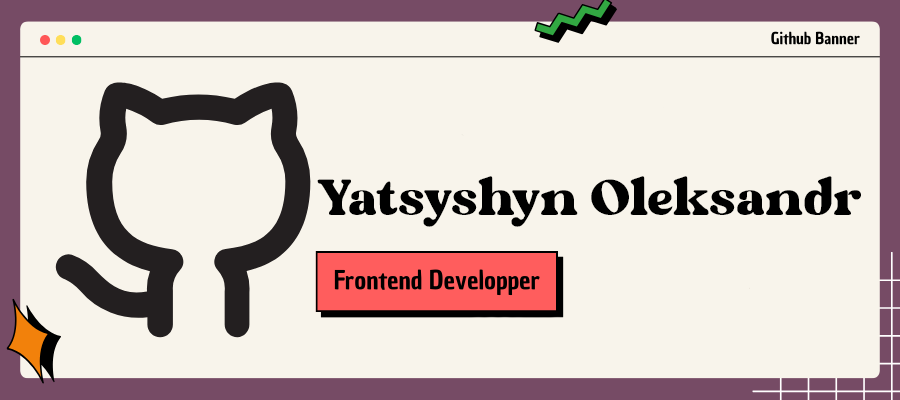

<!-- Section 1: Automated Typing -->

  

  

<h2>👩🏻‍💻 Languages and Tools</h2>

  
  
  
  
  
  
   
  
  
  
  
  
  
  
  
  
  
  
  
  
  
  
  
   
  
  
  
  

<h2>📊 Stats and Activities</h2>

<h3>📉 Stats, Streaks and Trophies</h3>

  
  

 

  

<h3>📈 Activity Graph</h3>

  

<h3>⭐️ Top Languages & Some Random Dev Quotes</h3>

  
  

